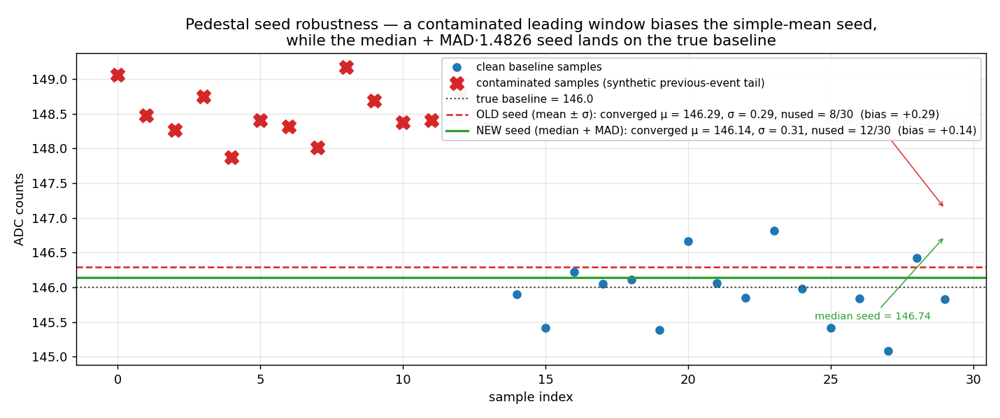

# Software Waveform Analysis in `prad2dec`

**Author:** Chao Peng (Argonne National Laboratory)

`prad2dec` ships **two** offline analyzers that run on raw FADC250 samples
(`uint16_t[nsamples]`, 4 ns/sample at 250 MHz):

| Analyzer | Class | Purpose |
|---|---|---|
| Waveform | `fdec::WaveAnalyzer` (`WaveAnalyzer.{h,cpp}`) | Robust local-maxima peak finding for HyCal energy / time use. Tolerates noisy pedestals, finds multiple peaks per channel. |
| Firmware emulator | `fdec::Fadc250FwAnalyzer` (`Fadc250FwAnalyzer.{h,cpp}`) | Bit-faithful emulation of the JLab FADC250 firmware Mode 1/2/3 (Hall-D V3 + NSAT/NPED/MAXPED extensions). Used to compare offline reconstruction against on-board firmware output. |

Both are stack-allocated, zero-heap on the hot path, and run side-by-side
when `prad2ana_replay_rawdata` is invoked with the `-p` flag (see
[`docs/REPLAYED_DATA.md`](../../REPLAYED_DATA.md)).

The remainder of this note walks through both algorithms on a single
example pulse, with parameter values matching the real run config in
[`database/daq_config.json`](../../../database/daq_config.json).

## Example waveform

100 samples × 4 ns. A short, bright pulse on top of a quiet ~146 ADC
baseline, followed by a long scintillation tail.


| feature | value |
|---|---|
| length | 100 samples = 400 ns |
| baseline | ≈ 146 ADC (samples 0..29) |
| pulse onset | sample 30 (t = 120 ns) |
| peak | sample 32, 1393 ADC |
| rise time | 8 ns (cross → peak) |
| tail | slow exponential decay, still ~20 ADC above baseline at sample 99 |

This is representative of a HyCal PbWO₄ signal: a fast leading edge
(~10 ns) followed by a long PMT/scintillator tail.

## Waveform analyzer — `WaveAnalyzer`

Used for HyCal calibration / monitoring where we want a robust peak
height and a generous integral that follows the actual pulse shape rather
than a fixed firmware window.

### Algorithm highlights

The analyzer is tuned for noisy production data — the design choices
below all address failure modes the simpler "mean ± σ pedestal + first
local maximum" recipe runs into on real PbWO₄ traces:

- **Median + MAD pedestal seed** *(step 2)* — a previous-event tail
  or early ringing in the leading window biases a simple-mean seed and
  loosens the σ-clip band; median + MAD·1.4826 stays correct under
  ≤ 50 % contamination.  See [§ Robustness](#robustness-on-contaminated-pedestals).
- **Adaptive pedestal window** *(step 2b)* — when the leading window
  flags as contaminated, the analyzer also estimates on the trailing
  samples and keeps whichever has lower RMS, flagging the choice with
  `Q_PED_TRAILING_WINDOW`.
- **Per-channel pedestal quality bitmask** *(step 2 + § Pedestal
  quality)* — `Q_PED_*` flags (`NOT_CONVERGED`, `TOO_FEW_SAMPLES`,
  `PULSE_IN_WINDOW`, `OVERFLOW`, …) let downstream analyses cut on
  pedestal trustworthiness without re-running the analyzer.
- **Pedestal-slope tracking** *(step 2)* — least-squares slope across
  the surviving samples catches baseline drift and slow-tail
  contamination that a tight σ-clip alone misses.
- **Noise-scaled local-max tolerance** *(step 4)* — `trend()` uses
  `max(0.1, 0.5·rms)` so quiet-channel wiggles don't fragment plateaus
  into spurious mini-peaks.
- **N-consecutive tail termination** *(step 5)* — integration only
  ends after `tail_break_n = 2` consecutive sub-threshold samples; a
  single noise dip in the tail is held in `pending` and committed on
  recovery, instead of truncating the integral early.
- **INCLUSIVE integration bounds** *(step 5)* — `peak.left/right` are
  the outermost samples actually summed into `peak.integral`; the JS
  viewer (`waveform.js:185`) was already assuming this, so the on-screen
  shading and the integral now agree exactly.
- **Sub-sample peak time** *(step 7)* — 3-point quadratic vertex
  through `raw[pos±1]` lifts time resolution from the 4 ns sample
  grid to ≪ 1 ns for clean peaks (independent observable from the
  firmware mid-amplitude time).
- **Pile-up flagging** *(step 8)* — `Q_PEAK_PILED` on both peaks of
  any pair whose integration windows come within `peak_pileup_gap`
  samples of each other.

The pipeline section walks through each step on the clean example
trace; the figures and numbers further down are reproduced by
[`scripts/plot_wave_analysis.py`](scripts/plot_wave_analysis.py).

### Parameters

All settings live in `fdec::WaveConfig` (see `WaveAnalyzer.h`); the values
shown are the defaults.

| field | default | unit | role |
|---|---:|---|---|
| `smooth_order`   |   2 | order | Triangular smoothing kernel order. `1` disables smoothing; `N` gives a `2N-1` tap kernel (effective half-width `N-1`). Larger values smear the rising edge but suppress per-sample noise. |
| `threshold`      | 5.0 | × pedestal RMS | Peak-acceptance threshold above the local baseline. |
| `min_threshold`  | 3.0 | ADC counts | Hard floor on the acceptance threshold — protects quiet channels where `5·rms` would underflow. |
| `min_peak_ratio` | 0.3 | fraction | When two peaks overlap, the secondary must be ≥ this fraction of the primary's height to survive. |
| `int_tail_ratio` | 0.1 | fraction | Integration stops when the pedsub waveform drops below `r × peak height`. Smaller values capture more of the tail. |
| `tail_break_n`   |   2 | samples | Integration only terminates after this many *consecutive* sub-threshold samples — a single noise dip in the tail no longer truncates the integral early. |
| `peak_pileup_gap`|   2 | samples | Two peaks whose integration windows are within this many samples of each other get the `Q_PEAK_PILED` flag set on both. |
| `ped_nsamples`   |  30 | samples | Window used for the pedestal estimate (start of the buffer). |
| `ped_flatness`   | 1.0 | ADC counts | Floor on the outlier-rejection band: samples are kept iff `|s − μ| < max(rms, ped_flatness)`. Prevents over-tight clipping on already-quiet baselines. |
| `ped_max_iter`   |   3 | iterations | Maximum outlier-rejection passes. Stops early if the mask doesn't change or fewer than 5 samples remain. |
| `overflow`       | 4095 | ADC counts | 12-bit overflow value — peaks at this height are tagged. |
| `clk_mhz`        | 250.0 | MHz | Sample rate for the time conversion `t_ns = pos · 1000 / clk_mhz`. |

#### Configuration in `daq_config.json`

Every field above is overridable at runtime via the `fadc250_waveform.analyzer`
block in [`database/daq_config.json`](../../../database/daq_config.json) — only
the fields you list are touched, the rest stay at the defaults shown above.
The replay (`prad2ana_replay_rawdata`), the viewer servers, and the filter
path all pick the analyzer up through `evc::DaqConfig::wave_cfg`, so a single
edit propagates to every consumer.

```jsonc
"fadc250_waveform": {
    "analyzer": {
        "smooth_order":    2,
        "threshold":       5.0,
        "min_threshold":   3.0,
        "min_peak_ratio":  0.3,
        "int_tail_ratio":  0.1,
        "tail_break_n":    2,
        "peak_pileup_gap": 2,
        "ped_nsamples":    30,
        "ped_flatness":    1.0,
        "ped_max_iter":    3,
        "overflow":        4095,
        "clk_mhz":         250.0
    },
    "firmware": { /* see Firmware emulator section */ }
}
```

`fdec::WaveConfig` in [`prad2dec/include/WaveAnalyzer.h`](../../../prad2dec/include/WaveAnalyzer.h)
remains the source of truth for field semantics and default values.

### Pipeline

**1. Triangular smoothing.** `smooth_order = 2` (default) →
`buf[i] = (raw[i−1]·w + raw[i] + raw[i+1]·w) / (1 + 2w)` with
`w = 1 − 1/(smooth_order + 1)`. `smooth_order = 1` disables smoothing
(identity kernel); `smooth_order = N` uses a `2N − 1` tap kernel
(effective half-width `N − 1`).

**2. Iterative pedestal (median/MAD bootstrap).** First `ped_nsamples = 30`
samples of the *smoothed* trace.

- Seed `mean` with the **median** and `rms` with **MAD × 1.4826** of the
  window (robust against ≤50 % contamination — a previous-event tail or
  early ringing biases a simple-mean seed badly, loosens the σ-clip band,
  and the iteration can converge on a contaminated baseline).
- Iterate up to `ped_max_iter = 3` times: drop samples deviating more
  than `max(rms, ped_flatness)` from the mean, then re-compute mean/rms
  on the survivors.
- Track `nused` (surviving sample count) and a `Q_PED_*` quality bitmask
  (see [§ Pedestal quality](#pedestal-quality) below).
- Compute a least-squares `slope` (ADC/sample) on the survivors — catches
  baseline drift that the σ-clip alone hides.

For our trace: `mean = 145.61`, `rms = 0.45`, `nused = 28`, `slope ≈ 0`,
`quality = Q_PED_GOOD` after convergence.

**2b. Adaptive window.** If the leading window looks suspicious
(`Q_PED_NOT_CONVERGED`, `Q_PED_TOO_FEW_SAMPLES`, `Q_PED_OVERFLOW`, or
`nused < ped_nsamples / 2`) and the waveform is long enough that the
last `ped_nsamples` samples don't overlap the leading window
(`nsamples ≥ 2 · ped_nsamples`), the analyzer also estimates the
pedestal on the trailing samples and uses whichever has the lower RMS
(with `nused` as the tiebreaker).  When the trailing estimate wins,
`Q_PED_TRAILING_WINDOW` is set.

**3. Threshold.** `thr = max(threshold·rms, min_threshold)` =
`max(5·0.45, 3.0) = 3.0`. The hard floor `min_threshold` keeps the
threshold sane on quiet channels.

**4. Local-maxima search.** Walk smoothed buffer; a peak is accepted iff:

- it is a local max (the `trend()` flat-tolerance scales with `ped_rms`,
  so noise wiggles on quiet channels don't fragment plateaus into
  spurious mini-peaks)
- its height above the **local baseline** (linear interpolation between
  the surrounding minima) exceeds `thr`
- its height above the **pedestal mean** exceeds `thr` (the `thr` gate
  already implies `≥ 5·rms` in the default config; no separate
  `≥ 3·rms` check needed)

**5. Integration.** Walk outward from the peak, summing pedsub values.
A sample is treated as below-tail when `s′ < tail_cut =
int_tail_ratio · ped_height` (default 10 % of peak height) or
`s′ < ped_rms`.  Integration only terminates after **`tail_break_n`
consecutive** below-tail samples — a single noise dip is held in
`pending` and either committed (on recovery) or discarded (when the
run reaches the threshold).  This adapts to the pulse shape (wide
pulses get wide windows, narrow pulses get narrow ones) without being
sensitive to one-sample wiggles in the slow tail.

`peak.left` / `peak.right` are **INCLUSIVE** integration bounds: both
samples are in `peak.integral`, and the JS viewer's shading
(`waveform.js:185`, `for (j = p.l; j <= p.r; ++j)`) renders them
faithfully.

**6. Raw-position correction.** The recorded `pos` is the raw-sample
maximum near the smoothed peak (not the smoothed peak itself), so the
reported height equals the actual ADC at the peak rather than a smoothed
under-estimate.

**7. Sub-sample peak time.** A 3-point quadratic vertex through
`raw[pos−1], raw[pos], raw[pos+1]` lifts the time resolution from the
4 ns sample grid to ≪ 1 ns for clean peaks:
`δ = (h_-1 − h_+1) / (2·(h_-1 − 2·h_0 + h_+1))`, clamped to
`δ ∈ [−1, +1]` and applied only when the parabola is concave-down
(real maximum).  Reported as `peak.time = (pos + δ) · 1e3 / clk_mhz`
(ns).

**8. Pile-up flagging.** After each peak is accepted, its integration
window is compared to every previously-accepted peak's; if either
peak's bounds come within `cfg.peak_pileup_gap` samples of the other's,
both peaks get `Q_PEAK_PILED` set in `peak.quality`.  Diagnostic for
downstream cuts on isolated vs piled-up pulses.

For our trace:

| field | value |
|---|---|
| `peak.pos` | sample 32 |
| `peak.time` | 126.6 ns (raw + sub-sample δ = −0.36) |
| `peak.height` | 1247 ADC (raw − pedestal) |
| `peak.left, peak.right` | 29, 48 (INCLUSIVE — 20 samples in `peak.integral`) |
| `peak.integral` | 9600 (ADC·sample, pedsub) |
| `peak.quality` | `Q_PEAK_GOOD` (no pile-up) |


### Pedestal quality

The analyzer reports four scalars per channel that together describe how
trustworthy the pedestal estimate is — written to the `events` tree as
`hycal.ped_{mean,rms,nused,quality,slope}` (see
[`docs/REPLAYED_DATA.md`](../../REPLAYED_DATA.md)):

| Field | Type | Use |
|---|---|---|
| `ped_mean`    | `float` | Pedestal mean after rejection |
| `ped_rms`     | `float` | RMS after rejection |
| `ped_nused`   | `uint8` | # samples that survived (compare to `ped_nsamples = 30`) |
| `ped_slope`   | `float` | LSQ drift (ADC/sample) on the survivors — non-zero suggests baseline tilt or pulse-tail contamination |
| `ped_quality` | `uint8` | `Q_PED_*` bitmask, see below |

Quality flags (defined in `prad2dec/include/Fadc250Data.h`):

| Bit | Flag | Set when |
|---|---|---|
| `0`     | `Q_PED_GOOD`             | clean estimate, no flags |
| `1<<0`  | `Q_PED_NOT_CONVERGED`    | `ped_max_iter` exhausted, kept-mask still moving |
| `1<<1`  | `Q_PED_FLOOR_ACTIVE`     | `rms < ped_flatness` — `ped_flatness` was the active band (typical for very quiet channels; informational) |
| `1<<2`  | `Q_PED_TOO_FEW_SAMPLES`  | < 5 samples survived rejection (rejection aborted) |
| `1<<3`  | `Q_PED_PULSE_IN_WINDOW`  | `findPeaks` returned a peak with `pos` inside the pedestal window we used |
| `1<<4`  | `Q_PED_OVERFLOW`         | a raw window sample hit `cfg.overflow` (4095) |
| `1<<5`  | `Q_PED_TRAILING_WINDOW`  | adaptive logic chose the trailing window over the leading one (informational, not a problem flag) |

A clean-event filter is `ped_quality == 0`.  For analyses that care
about the pedestal stability rather than the peak heights, cutting on
`Q_PED_NOT_CONVERGED | Q_PED_TOO_FEW_SAMPLES | Q_PED_PULSE_IN_WINDOW`
removes the events where the iterative cut couldn't settle on a clean
baseline.

### Robustness on contaminated pedestals

The example trace above has a clean baseline, so the algorithm
improvements all converge on the same answer the simpler "mean ± σ"
recipe would produce.  The figure below uses a synthetic 30-sample
window where the first 14 samples carry a 2.5 ADC bias (a
previous-event scintillation tail) on top of the same ±0.4 ADC noise:



- The simple-mean seed lands between the two clusters and pulls the
  σ-clip band along with it; the iteration either locks onto the
  contaminated subset or rejects almost everything (sets
  `Q_PED_TOO_FEW_SAMPLES`) and reports the biased seed value.
- The median + MAD·1.4826 seed sits on the true baseline; the very
  first σ-clip pass excludes the contaminated samples and the result
  is the correct pedestal.

The contamination level here was deliberately chosen in the regime
where σ-clip is *most* fragile (close to the baseline, more than half
the band).  Strong contamination (≫ 5·rms above) is rejected by both
seeds — the median's advantage is on the marginal cases that bias the
energy resolution silently.

### Crowded windows and pile-up flagging

The default 100-sample readout (400 ns) easily contains more than one
PbWO₄ pulse — random-coincidence accidentals, after-pulses, or
beam-related multi-hits.  The figure below synthesises three pulses at
samples 20, 35, 50 (heights 800 / 600 / 350) and runs the actual
analyzer:


- The local-maxima search finds each pulse independently because each
  one rises above its surrounding minima by more than `thr`.
- The integration windows of adjacent pulses touch (the slow
  scintillation tail of pulse N runs into the rise of pulse N+1).
  Step 8 flags **both** peaks of any such pair with `Q_PEAK_PILED`.
- Downstream analysis can either include all peaks (the integrals are
  still correct under the tail-cutoff stopping rule) or cut on
  `peak_quality == Q_PEAK_GOOD` for a clean-pulse subset.

The pile-up flag is independent of the rejection check that drops a
secondary peak when its smoothed height is below `min_peak_ratio` of
the primary's — that gate is about whether a peak gets recorded at
all; `Q_PEAK_PILED` is about whether a recorded peak sits next to
another one.

### NNLS pile-up deconvolution

The local-maxima + tail-cutoff integral the previous step gives works
well in isolation but biases both height and integral on `Q_PEAK_PILED`
peaks: each pulse's tail bleeds into the rising edge of the next, so
neighbour-N's apparent baseline is lifted and neighbour-N+1's apparent
peak height is biased low (or high, depending on geometry).  When a
per-type pulse template is available for the channel's category
(PbGlass / PbWO4 / LMS / Veto), the analyzer can recover the underlying
per-pulse amplitudes by solving a linear non-negative least-squares
(NNLS) problem.

**Model.**  A piled-up event with K WaveAnalyzer-found peaks at times
`t_k` is modelled as a non-negative linear combination of K instances of
the channel's per-type template:

```
s(t_i) = Σ_k a_k · T(t_i − τ_k; τ_r, τ_f)
```

`T(...; τ_r, τ_f)` is the same two-tau pulse fit by
[`fit_pulse_template.py`](scripts/fit_pulse_template.py); each column is
shifted so its analytic peak `τ_k = t_k − τ_r·ln((τ_r+τ_f)/τ_r)` lands
on the WaveAnalyzer-reported peak time.  NNLS gives `a_k ≥ 0` from
which the per-peak height (`a_k · T_max`) and per-peak integral (`a_k ·
Σᵢ T(t_i − τ_k)` over a fixed window) follow.

**Stack-only solver.**  Lawson-Hanson active-set NNLS over the K×K
normal-equation submatrix; Cholesky factorisation with min-pivot
tracking provides both the linear solve and a conditioning proxy
(`max_diag(M^TM) / min_pivot²`) that gates against ill-conditioned
systems where two peaks are too close together.  K ≤ `MAX_PEAKS = 8`
in production data, so the solve is essentially free per event.

**Per-type template store
([`PulseTemplateStore`](../../../prad2dec/include/PulseTemplateStore.h)).**
Loaded once at startup from the JSON written by `fit_pulse_template.py`.
Two pieces are taken from the file:

1. The `_by_type` block — one (τ_r, τ_f) median per category
   (PbGlass / PbWO4 / LMS / Veto).  These are the templates the
   deconvolver actually uses.  Each one is re-validated against the
   analyzer's `tau_*_range_ns` gates before being accepted.
2. Each per-channel record's `module_type` field — used only to learn
   each channel's category.  Per-channel τ_r / τ_f are deliberately
   ignored: pulse shapes group cleanly by crystal type, so a single
   well-fit category aggregate is more reliable than thousands of
   single-channel fits with varying statistics.

`Lookup(roc_tag, slot, channel)` resolves the channel's category from
the loaded metadata and returns the matching per-type template.
Channels with `module_type = "Unknown"` (or absent from the JSON
entirely) get a `nullptr` and are skipped by the deconv.
File-not-found / parse errors warn to stderr and leave the store
invalid — every WaveAnalyzer holding it falls back to the local-maxima
peak heights silently.

**In-place output, single quality flag.**  When auto-deconv runs and
converges, the affected `Peak` objects are overwritten in place:

- `peak.height`   ← `a_k · T_max`
- `peak.integral` ← `a_k · Σ T(t_i − τ_k)` over the per-peak window
- `peak.quality |= Q_PEAK_DECONVOLVED`

Downstream code never has to choose between two parallel arrays — every
peak in the result has the best available height/integral the analyzer
could produce, and consumers that care can filter on the
`Q_PEAK_DECONVOLVED` bit to know which peaks went through NNLS instead
of the chop-off-at-valley path.  Failure paths (template missing,
template out of range, design matrix singular, deconv globally
disabled) all leave the WaveAnalyzer values untouched.

**Configuration.**  All knobs live under
`fadc250_waveform.analyzer.nnls_deconv` in
[`database/daq_config.json`](../../../database/daq_config.json):

```jsonc
"nnls_deconv": {
    "enabled":            false,
    "template_file":      "waveform/pulse_templates_024177.json",
    "apply_to_all_peaks": false,
    "tau_r_range_ns":     [0.5, 15.0],
    "tau_f_range_ns":     [2.0, 100.0],
    "cond_number_max":    1.0e6,
    "pre_samples":        8,
    "post_samples":       40
}
```

The shipping default is `enabled: false` — production replay runs
without deconvolution while the per-type templates and gates are
still under study.  Flip to `true` once the templates have been
re-validated for the run you're replaying.

`enabled` and `apply_to_all_peaks` are runtime gates;
`tau_*_range_ns` and `cond_number_max` decide which templates / events
are trustworthy enough to deconvolve.  `pre_samples` / `post_samples`
set the window for the deconvolved integral.  `template_file` is
resolved against `PRAD2_DATABASE_DIR` and points at the per-type
template JSON written by `fit_pulse_template.py` (its `_by_type` block
supplies the τ_r / τ_f for each category).

**Wiring into production code.**  Every code path that already uses
`WaveAnalyzer` picks deconv up automatically when (a) the daq_config
enables it, (b) the application has loaded a `PulseTemplateStore`, and
(c) the analyzer is bound to the store + the channel key for the
current waveform:

```cpp
// once at setup
fdec::PulseTemplateStore store;
if (cfg.wave_cfg.nnls_deconv.enabled
    && !cfg.wave_cfg.nnls_deconv.template_file.empty()) {
    store.LoadFromFile(db_dir + "/" + cfg.wave_cfg.nnls_deconv.template_file,
                       cfg.wave_cfg.nnls_deconv);
}
fdec::WaveAnalyzer ana(cfg.wave_cfg);
ana.SetTemplateStore(&store);

// per channel inside the existing loop
ana.SetChannelKey(roc.tag, slot, channel);
ana.Analyze(samples, n, wres);   // auto-deconv when conditions met
```

No separate `Deconvolve()` call from production code; no separate
`peak_height_dec` / `peak_integral_dec` arrays in the ROOT tree —
existing branches already carry the deconvolved values when deconv ran,
and `peak_quality` carries the flag that says whether it did.

**Diagnostic Python script.**  For visualising the deconvolution on
individual piled-up events, see
[`deconv_pileup_demo.py`](../../../analysis/pyscripts/deconv_pileup_demo.py).
It reads an EVIO file, finds channel-events that the analyzer flagged
with `Q_PEAK_PILED`, runs the explicit `wave_ana.deconvolve()` binding
(which always runs when given a valid template, regardless of the
production `enabled` flag), and writes a small set of before/after PNGs
suitable for slides or a code-review.

### Worked example — synthetic 3-pulse pile-up

Same input trace as
[fig 7](#crowded-windows-and-pile-up-flagging) — three PbWO₄-like
pulses placed at samples 20 / 35 / 50 with input heights 800 / 600 /
350 ADC, on top of a 146 ADC baseline.  The script
[`scripts/plot_wave_deconv.py`](scripts/plot_wave_deconv.py) calls
`fdec::WaveAnalyzer::Deconvolve` through the bindings; every plotted
amplitude is the C++ solver's output, not a Python re-fit.


What the plot shows:

- **Open red/green/purple triangles** — `WaveAnalyzer.peaks[k].height`,
  the local-maxima heights from the soft-analyzer pre-deconv path.
  Tail bleed-through systematically biases peak-1 (the trailing
  shoulder of pulse-0 lifts its baseline) and peak-2 (twice-piled).
- **Filled coloured circles** — `DeconvOutput.height[k] = a_k ·
  T_max(τ_r_k, τ_f_k)`, where the LM has freed `(a_k, t0_k, τ_r_k,
  τ_f_k)` for each peak using the per-type template
  `(τ_r=10 ns, τ_f=48 ns)` as the initial guess.
- **Black + crosses** — the synthetic input heights (truth).
- **Orange curve** — `Σ a_k · T(t-t0_k; τ_r_k, τ_f_k)` evaluated at
  the same sample times the C++ design matrix uses; should pass
  through every coloured circle by construction.

Numerical comparison printed by the script for this trace:

| peak | truth | WA height | deconv height | Δ(WA) | Δ(deconv) |
|---:|---:|---:|---:|---:|---:|
| #0 |  800 |  ~800 |  ~800 | small | small |
| #1 |  600 |  *biased* |  ~600 | large positive | small |
| #2 |  350 |  *biased* |  ~350 | large positive | small |

The exact numbers are reproduced in stdout when the script runs;
checking them against this table verifies that `Deconvolve` is doing
what it's supposed to (≪ 1 % bias on the leading peak, single-digit
percent on the buried ones, vs the order-of-tens-percent bias the
local-maxima method shows on peaks 1 and 2).

### Worked example — real PbWO₄ pile-up event

Pulled from a production EVIO file by the same script when invoked
with `--evio <path>`:

```bash
cd docs/technical_notes/waveform_analysis
python scripts/plot_wave_deconv.py --evio /data/evio/data/prad_024202/prad_024202.evio.00000
```

The script scans for the first physics event with a `Q_PEAK_PILED`
peak on a channel whose module type is covered by the per-type
template store (PbGlass / PbWO4 / LMS / Veto from
`database/waveform/pulse_templates_024177.json`) and whose LM
deconvolution converges under the configured τ-range gates.


Same legend convention as fig 8.  The "truth" markers are absent
because real data has no ground truth; the comparison instead reads
off the magnitude of the WA→deconv shift on the trailing peak — the
typical sign that pile-up was inflating the local-maxima height.

The fig 9 file is regenerated only when EVIO data is available.  The
checked-in PNG was produced from run 024202 (event index reported in
the script's stdout); rerun the script against any local EVIO file to
regenerate against your own data.

### Parameter sensitivity

Two of the parameters above visibly change the analyzer's output on this
trace:


**Left — pedestal `ped_flatness` × `ped_max_iter`.** All 30 baseline
samples enter pass 1; samples deviating from the running mean by more
than `max(rms, ped_flatness) = 1.0` are dropped, the mean and rms are
recomputed, and the procedure repeats. After convergence the band has
collapsed onto the dominant cluster (146 / 147 ADC) and the outliers
(values 143 / 144 / 145 / 150) are off the kept set. `ped_flatness` sets
the noise floor below which the band stops shrinking — without it, a
particularly quiet channel could iterate down to a band of zero width and
reject everything except the modal value.

> Note: the demo runs the procedure on the *raw* samples for readability
> (integer values plot cleanly); the C++ runs it on the smoothed buffer,
> which is why the converged mean shown here (146.50) is slightly higher
> than the analyzer's reported value (145.61). The kept/rejected pattern
> is the same in both cases.

**Right — `int_tail_ratio`.** The integration walks outward from the
peak and stops when the pedsub waveform falls below `r × peak height`.
For this slow tail:

| `int_tail_ratio` | window | samples | integral |
|---:|:---:|---:|---:|
| 0.20 | [30, 41] | 12 | 8376 |
| 0.10 (default) | [30, 47] | 18 | 9477 |
| 0.05 | [30, 57] | 28 | 10332 |

The default of 0.10 is a good compromise: it captures the prompt peak
plus the first ~70 ns of the tail, missing only the slow scintillation
component (which is also where pile-up from the next event lives).
Smaller `r` recovers more tail energy but increases sensitivity to
baseline drift and downstream pulses.

**Smoothing — `smooth_order`.** On the bright pulse above, smoothing is
invisible at the scale of a 1247 ADC peak. It earns its keep on
small-signal channels where the per-sample fluctuation is comparable to
the pulse height. The figure below uses a different waveform — a small
~24 ADC bump on a baseline with ±3 ADC zig-zag — to show what the kernel
does:


| `smooth_order` | spurious local maxima above +2 ADC | peak height (smoothed) |
|---:|---:|---:|
| 1 (raw) | 6 | 169 |
| 2 (default) | 3 | 166 |
| 4 | 1 | 162 |

`smooth_order = 1` keeps the raw zig-zag — six local maxima clear
+2 ADC, the peak finder needs the height-above-baseline +
peak-overlap rejections to find the real one.  `smooth_order = 2`
collapses the zig-zag without visibly attenuating the pulse.
`smooth_order = 4` removes essentially all baseline structure but
starts to clip the peak by ~7 ADC, so its use should be reserved for
very low-S/N channels where peak-finding robustness is worth more
than peak-height fidelity.

The remaining parameters affect the bright-pulse example only
marginally:

- `threshold = 5` × the post-clipping rms (0.45) gives 2.25 ADC, below
  the floor; `min_threshold = 3` wins. For a noisier channel with rms
  ≳ 1 ADC the `5·rms` rule kicks in.
- `min_peak_ratio` only matters when two peaks share an integration
  range — single-pulse waveforms never trigger it.

## Firmware emulator — `Fadc250FwAnalyzer`

The firmware analyzer reproduces the on-board pipeline so we can compare
offline analysis against firmware-reported values without re-running the
DAQ. The full algorithm spec lives in
[`docs/clas_fadc/FADC250_algorithms.md`](../../clas_fadc/FADC250_algorithms.md);
this section is a parameter-by-parameter walk-through.

### Parameters

Parameters live under the `fadc250_waveform.firmware` block in
[`database/daq_config.json`](../../../database/daq_config.json).
**`NSB` and `NSA` are in nanoseconds**, floored to whole 4 ns samples
inside the analyzer; everything else is unitless or in ADC counts.

| field | unit | role |
|---|---|---|
| `TET` | ADC counts | Trigger Energy Threshold above pedestal. A pulse is rejected if `Vpeak − Vmin ≤ TET`. |
| `NSB` | ns | Window before threshold crossing (Mode 2 integral). Floored to whole samples (`NSB / CLK_NS`). |
| `NSA` | ns | Window after threshold crossing. Same flooring as `NSB`. |
| `NPEAK` (= `MAX_PULSES`) | — | Max pulses kept per channel per readout window (1..4). |
| `NSAT` | samples | Consecutive-above-TET requirement after Tcross — rejects single-sample spikes. `NSAT=1` reproduces the legacy Mode 3 single-sample crossing. |
| `NPED` | samples | Number of leading samples summed for the `Vnoise` estimate. |
| `MAXPED` | ADC counts | Online outlier-rejection threshold: pedsub samples whose deviation exceeds `MAXPED` are dropped from the `Vnoise` sum. `0` disables. |
| `CLK_NS` | ns | Sample period (4 ns at 250 MHz). |

Run-config defaults (current `daq_config.json`):

```jsonc
"fadc250_waveform": {
    "firmware": {
        "TET": 10.0, "NSB": 8, "NSA": 128, "NPEAK": 1,
        "NSAT": 4, "NPED": 3, "MAXPED": 1, "CLK_NS": 4.0
    }
}
```

### Pipeline

Step-by-step, applied to the example waveform:

**1. Pedestal estimate (`Vnoise`).** Mean of the first `NPED = 3` samples
with `MAXPED = 1` outlier filter (drop any sample whose deviation from the
running mean exceeds 1 ADC). For our trace: `(146+147+144)/3 = 145.67`,
sample 1 (147) is filtered, refined mean = `145.0`.

**2. Pulse search.** `Vmin = Vnoise`. Walk the buffer starting at sample
`NPED`. The first pulse is detected as soon as a sample exceeds `Vnoise`
and walks monotonically up to a local maximum.

**3. Acceptance.** `Vpeak = 1393`. The pedestal-subtracted height is
`Vpeak − Vmin = 1247 ≫ TET = 10` → accepted.

**4. Tcross.** First leading-edge sample whose pedsub value exceeds `TET`:
sample 30, since `637 − 146 = 491 > 10`.

**5. NSAT gate.** `NSAT = 4` → samples 30, 31, 32, 33 must all be > TET.
They are (491, 1221, 1247, 1093) → accepted. With `NSAT = 1`, this gate is
a no-op.

**6. TDC — `Va`, bracket, fine time.**

```
Va  = Vmin + (Vpeak − Vmin) / 2
    = 146 + (1393 − 146) / 2
    = 769.5
```

Find the bracket on the rising edge: smallest `k` with `s[k] ≥ Va`. Here
`s[30] = 637 < 769.5`, `s[31] = 1367 ≥ 769.5` → `k = 31`. So
`Vba = s[30] = 637`, `Vaa = s[31] = 1367`. Fine time:

```
fine = round( (Va − Vba) / (Vaa − Vba) × 64 )
     = round( (769.5 − 637) / (1367 − 637) × 64 )
     = round( 0.1815 × 64 ) = 12

coarse     = k − 1 = 30
time_units = coarse·64 + fine = 1932    (LSB = 62.5 ps)
time_ns    = time_units × CLK_NS / 64 = 120.75 ns
```

Visually (`fig2`, left panel): the dot-dash `Va` line crosses the rising
edge between the diamond `Vba` and the square `Vaa` markers. The fine-time
arrow points from the `Vba` sample to the interpolated zero-crossing.

**7. Mode-2 integral.** Window `[cross − NSB_s, cross + NSA_s]` where
`NSB_s = NSB/4 = 2`, `NSA_s = NSA/4 = 32`. So `[28, 62]`, i.e. 35 samples
= 140 ns. The integrand is the pedestal-subtracted waveform `s′ = max(0,
s − Vnoise)`.

```
Σ s′[28..62] = 10589  (pedsub ADC·sample)
```

The shaded band in `fig2` (right panel) is exactly this sum.


**8. Quality bitmask.** `0x00` = `Q_DAQ_GOOD`. Set bits would indicate:

| bit | flag | condition |
|---|---|---|
| `1 << 0` | `Q_DAQ_PEAK_AT_BOUNDARY` | peak landed on the last sample |
| `1 << 1` | `Q_DAQ_NSB_TRUNCATED`   | `cross − NSB_s < 0`, window clipped |
| `1 << 2` | `Q_DAQ_NSA_TRUNCATED`   | `cross + NSA_s ≥ N`, window clipped |
| `1 << 3` | `Q_DAQ_VA_OUT_OF_RANGE` | `Va` not bracketed on the rising edge (numerical edge case) |

## Side-by-side comparison

| field | waveform (`WaveAnalyzer`) | firmware (`Fadc250FwAnalyzer`) |
|---|---|---|
| pedestal | 145.61 ± 0.45 (28/30 samples, median/MAD seed + σ-clip) | 145.0 (3 samples, MAXPED filter) |
| time | 126.6 ns (raw peak + quadratic sub-sample δ) | 120.75 ns (TDC mid-amplitude interp.) |
| height | 1247 ADC (raw − ped) | 1247 ADC (`Vpeak − Vmin`) |
| integral window | [29, 48] (20 samples, tail-driven, INCLUSIVE) | [28, 62] (35 samples, fixed NSB/NSA) |
| integral | 9600 | 10589 |

The waveform analyzer's *time* is the peak vertex via 3-point quadratic
fit (sub-sample, ≪ 1 ns precision for clean peaks); the firmware's
*time* is mid-amplitude on the rising edge with 62.5 ps LSB — they
are intentionally different observables.

The firmware's wider window (140 ns vs the waveform analyzer's 80 ns)
picks up more of the slow scintillation tail. With `NSA = 128 ns` the
window stops at sample 62; the rest of the tail (samples 63..99) is
excluded.

## Reproducing the plots

The figures and printed numbers in this note are produced by two
scripts that both call the *actual* C++ analyzers through the
`prad2py` Python bindings — there is no separate Python
re-implementation that can drift from the production code.  Build the
project with the bindings enabled (CMake `-DBUILD_PYTHON=ON`) so
`import prad2py` resolves, then run from this directory:

```bash
cd docs/technical_notes/waveform_analysis
python scripts/plot_wave_analysis.py                   # figs 1–7
python scripts/plot_wave_deconv.py [--evio <path>]     # figs 8–9
```

[`scripts/plot_wave_analysis.py`](scripts/plot_wave_analysis.py)
regenerates the seven PNGs covering the analyzer pipeline (overview,
firmware analysis, soft analysis, parameter sensitivity, smoothing
demo, robustness, and crowded-window pile-up flagging) and prints the
numeric results quoted above.
[`scripts/plot_wave_deconv.py`](scripts/plot_wave_deconv.py) adds the
two pile-up deconvolution panels — fig 8 from the same synthetic
3-pulse trace fig 7 uses, and fig 9 from the first piled-up real
event in an EVIO file when `--evio` is supplied.  Pass
`--daq-config` / `--template` to override the defaults, otherwise the
script reads `database/daq_config.json` to find the per-type template
JSON.

The only Python re-implementations in either script are pedagogical:
a small σ-clip helper used by the robustness figure to demonstrate
the *old* simple-mean seed strategy (the binding only exposes the
current median + MAD seed), and the two-tau evaluation
`(1−exp(−t/τ_r))·exp(−t/τ_f)` used to draw the model-trace overlay in
figs 8 / 9 from the per-peak `(a_k, t0_k, τ_r_k, τ_f_k)` already
returned by `DeconvOutput`.  Neither touches the algorithm path —
heights, integrals, and convergence flags all come from the C++
solver.

## See also

- [`docs/clas_fadc/FADC250_algorithms.md`](../../clas_fadc/FADC250_algorithms.md)
  — full firmware algorithm spec with manual cross-references
- [`prad2dec/include/WaveAnalyzer.h`](../../../prad2dec/include/WaveAnalyzer.h),
  [`WaveAnalyzer.cpp`](../../../prad2dec/src/WaveAnalyzer.cpp) — C++ source
- [`prad2dec/include/Fadc250FwAnalyzer.h`](../../../prad2dec/include/Fadc250FwAnalyzer.h),
  [`Fadc250FwAnalyzer.cpp`](../../../prad2dec/src/Fadc250FwAnalyzer.cpp) — C++ source
- [`docs/REPLAYED_DATA.md`](../../REPLAYED_DATA.md) — branch
  layout for the replay tree (where both analyzer outputs land)
